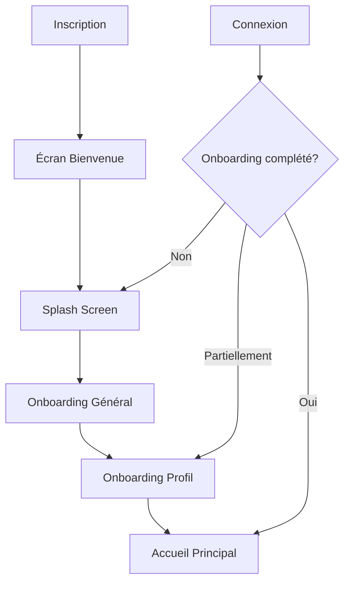
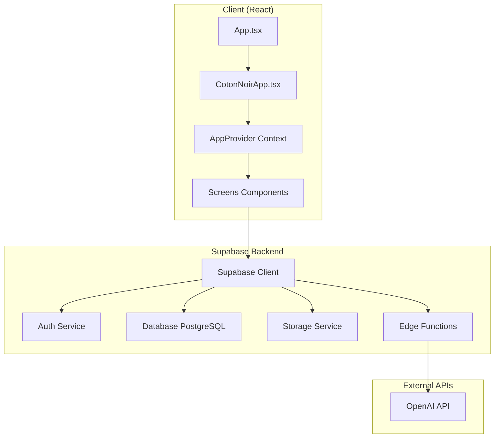

## TABLE DES MATIÈRES

1. [Vue d'ensemble](#vue-densemble)
2. [Spécifications fonctionnelles](#spécifications-fonctionnelles)
3. [Spécifications techniques](#spécifications-techniques)
4. [Architecture système](#architecture-système)
5. [Base de données](#base-de-données)
6. [API et intégrations](#api-et-intégrations)
7. [Sécurité](#sécurité)
8. [Performance](#performance)
9. [Tests et qualité](#tests-et-qualité)
10. [Déploiement](#déploiement)

---

## VUE D'ENSEMBLE

### Description du projet
**Coton Noir** est une application web mobile-first dédiée aux soins capillaires pour cheveux afro, crépus et bouclés. L'application propose une expérience gamifiée avec IA intégrée pour accompagner les utilisatrices dans leur routine capillaire.

### Objectifs principaux
- Démocratiser les soins capillaires adaptés aux cheveux texturés
- Créer une communauté engagée autour des soins capillaires
- Offrir des conseils personnalisés via l'IA
- Gamifier l'expérience de soin pour maintenir la motivation
- Générer des revenus via un modèle freemium et des partenariats

### Cible utilisateur
- Femmes 18-45 ans avec cheveux afro/crépus/bouclés
- Débutantes et expertes en soins capillaires
- Utilisatrices mobiles (90% du trafic)
- Marché francophone principal

---

## SPÉCIFICATIONS FONCTIONNELLES

### 1. AUTHENTIFICATION ET ONBOARDING

#### 1.1 Système d'authentification
- **Inscription/Connexion** via email/mot de passe
- **Récupération de mot de passe** par email
- **Redirection automatique** selon le statut d'onboarding
- **Session persistante** avec gestion des tokens

#### 1.2 Parcours d'onboarding
- **Écran de bienvenue** pour nouveaux utilisateurs
- **Splash screen** avec branding
- **Onboarding général** (4 slides explicatives)
- **Onboarding profil** avec questionnaire détaillé

**Workflow d'onboarding :**


#### 1.3 Profil capillaire détaillé
- **Type de cheveux** : 3A à 4C avec sous-catégories
- **Porosité** : Faible, moyenne, élevée
- **Objectifs** : Hydratation, définition, croissance, réparation
- **Problématiques** : Sécheresse, casse, frisottis, démêlage, cuir chevelu, chute
- **Besoins spécifiques** : Protection, brillance, volume

### 2. TABLEAU DE BORD PRINCIPAL

#### 2.1 Écran d'accueil personnalisé
- **Conseils IA personnalisés** basés sur le profil
- **Défis quotidiens** avec récompenses
- **Routine personnalisée** générée selon le profil
- **Statistiques mensuelles** de soins
- **Progression niveau** et CotonCoins
- **Accès rapide** aux fonctionnalités principales

#### 2.2 Système de gamification
- **CotonCoins (CC)** : Monnaie virtuelle de l'app
- **Niveaux** : Bronze, Argent, Or, Platine, Diamant
- **Badges** : Récompenses pour actions spécifiques
- **Streaks** : Suivi de régularité
- **Défis quotidiens** : Challenges personnalisés

**Système de récompenses :**
- Premier soin ajouté : +15 CC + Badge "Première fois"
- Profil complété : +100 CC
- Wash day enregistré : +25 CC + Badge "Wash Day Master"
- Défis quotidiens : 10-25 CC selon difficulté
- Streak 7 jours : Badge "Régularité"

### 3. JOURNAL DE SOINS

#### 3.1 Enregistrement des soins
- **Types d'entrées** : Soin, Routine
- **Champs obligatoires** : Date, titre, type
- **Champ optionnel** : Note descriptive
- **Anti-triche** : Validation temporelle et limits quotidiennes

#### 3.2 Validation et sécurité
- **Limite quotidienne** : 3 entrées par type maximum
- **Cooldown anti-spam** : 5 minutes entre entrées identiques
- **Validation dates** : Interdiction dates futures
- **Contrôle longueur** : Minimum 3 caractères pour titres

#### 3.3 Affichage et consultation
- **Vue chronologique** avec filtres
- **Journal complet** avec pagination
- **Statistiques** : Compteurs mensuels, types de soins
- **Intégration wash day** : Entrées automatiques

### 4. TRACKER DE WASH DAY

#### 4.1 Planification et suivi
- **Types de lavage** : Wash, Co-wash, Clarifiant, Nettoyage profond
- **Fréquence personnalisable** : Défaut 7 jours
- **Jour préféré** : Paramétrable par utilisateur
- **Rappels automatiques** : Optionnels

#### 4.2 Enregistrement détaillé
- **Produits utilisés** : Liste personnalisable
- **État des cheveux** : Échelle 5 niveaux (Excellent à Abîmé)
- **Notes libres** : Observations personnelles
- **Planification suivante** : Suggestion date prochaine

#### 4.3 Paramètres avancés
- **Fréquence adaptable** : 3-21 jours
- **Notifications** : Activable/désactivable
- **Planification auto** : Suggestion intelligente

### 5. SUIVI DE CROISSANCE

#### 5.1 Mesures capillaires
- **4 zones de mesure** : Front, côtés gauche/droit, arrière
- **Unité** : Centimètres avec décimales
- **Photos optionnelles** : Suivi visuel (MVP)
- **Notes personnelles** : Observations

#### 5.2 Objectifs de croissance
- **Longueur cible** : En centimètres
- **Date objectif** : Planification temporelle
- **Suivi progression** : Calculs automatiques
- **Visualisation** : Graphiques d'évolution

#### 5.3 Analyse et recommandations
- **Calcul vitesse croissance** : Mm/mois moyen
- **Prédictions** : Estimation atteinte objectif
- **Conseils adaptés** : Basés sur progression

### 6. INTELLIGENCE ARTIFICIELLE

#### 6.1 Conseils personnalisés
- **Modèle IA** : GPT-5 via API OpenAI
- **Personnalisation** : Basée sur profil complet
- **Types de conseils** :
  - Routine quotidienne/hebdomadaire
  - Recommandations produits
  - Conseils styling et coiffage
  - Adaptations saisonnières
  - Conseils généraux

#### 6.2 Génération de routines
- **Algorithme adaptatif** : Selon type, porosité, objectifs
- **Base de connaissances** : Techniques spécialisées cheveux texturés
- **Adaptation problématiques** : Sécheresse, casse, frisottis
- **Personnalisation besoins** : Hydratation, définition, protection

#### 6.3 Analyse de photos (Futur)
- **Vision IA** : Analyse état capillaire
- **Recommandations visuelles** : Basées sur observation
- **Suivi évolution** : Comparaisons temporelles

### 7. COMMUNAUTÉ ET SOCIAL

#### 7.1 Espace communautaire
- **Forum discussions** : Échanges entre utilisatrices
- **Partage expériences** : Témoignages et conseils
- **Questions/Réponses** : Entraide communautaire
- **Modération** : Système de signalement

#### 7.2 Fonctionnalités sociales
- **Profils publics** : Optionnels
- **Système de like** : Interactions positives
- **Commentaires** : Sur posts communauté
- **Abonnements** : Suivi utilisatrices favorites

### 8. ÉCOSYSTÈME PARTENAIRES

#### 8.1 Marques partenaires
- **Catalogue produits** : Base données partenaires
- **Codes promo** : Réductions exclusives
- **Cashback CotonCoins** : Retour sur achats
- **Reviews produits** : Avis communauté

#### 8.2 Professionnels
- **Annuaire coachs** : Spécialistes certifiés
- **Réservation créneaux** : Système booking
- **Consultations vidéo** : Intégration visio
- **Formation continue** : Contenu éducatif

#### 8.3 Points de vente
- **Géolocalisation** : Magasins à proximité
- **Stock temps réel** : Disponibilité produits
- **Click & collect** : Réservation en ligne
- **Programme fidélité** : Intégration points

### 9. TUTORIELS ET FORMATION

#### 9.1 Bibliothèque de contenu
- **Vidéos techniques** : Pas-à-pas détaillés
- **Guides écrits** : Tutoriels illustrés
- **Fiches produits** : Compositions et usage
- **Quiz formation** : Validation connaissances

#### 9.2 Parcours d'apprentissage
- **Niveaux progressifs** : Débutant à expert
- **Badges compétences** : Validation acquis
- **Recommandations personnalisées** : Selon profil
- **Suivi progression** : Pourcentage completion

### 10. SYSTÈME DE RÉCOMPENSES

#### 10.1 CotonBox virtuelle
- **Seuil déblocage** : 50 CotonCoins
- **Contenu surprise** : Codes promo, conseils exclusifs
- **Fréquence** : Quotidienne si seuil atteint
- **Progression visible** : Barre de progression

#### 10.2 Programme VIP (Premium)
- **Liste d'attente** : Inscription anticipée
- **Avantages exclusifs** : Accès prioritaire
- **Contenu premium** : Conseils experts
- **Support prioritaire** : Assistance dédiée

---

## SPÉCIFICATIONS TECHNIQUES

### 1. STACK TECHNOLOGIQUE

#### 1.1 Frontend
- **Framework** : React 18.3.1 avec TypeScript
- **Build Tool** : Vite (build rapide et HMR)
- **Routage** : React Router DOM 6.30.1
- **UI/UX** : 
  - Tailwind CSS 
  - Radix UI (composants accessibles)
  - Framer Motion (animations)
  - Lucide React (icônes)

#### 1.2 Backend et Services
- **BaaS** : Supabase (auth, database, storage, functions)
- **Base de données** : PostgreSQL (via Supabase)
- **Authentication** : Supabase Auth (JWT)
- **Storage** : Supabase Storage (photos profil, mesures)
- **Edge Functions** : Supabase Functions (Deno runtime)

#### 1.3 Intelligence Artificielle
- **Provider** : OpenAI API
- **Modèle principal** : GPT-5-2025-08-07
- **Modèle rapide** : GPT-5-mini-2025-08-07
- **Vision** : GPT-4o (analyse photos futures)

#### 1.4 State Management
- **Global State** : React Context + useReducer
- **Persistence** : localStorage avec sync automatique
- **Cache** : TanStack Query pour requêtes serveur
- **Forms** : React Hook Form + Zod validation

### 2. ARCHITECTURE SYSTÈME

#### 2.1 Architecture générale


#### 2.2 Flux de données
- **Unidirectionnel** : Actions → Reducer → State → UI
- **Persistence** : State ↔ localStorage sync
- **API Calls** : Components → Supabase Client → Server
- **Real-time** : Supabase Realtime (futur)

#### 2.3 Structure des composants
```
src/
├── components/
│   ├── screens/          # Écrans principaux
│   ├── ui/              # Composants UI réutilisables
│   └── common/          # Composants communs
├── contexts/            # Context providers
├── hooks/               # Custom hooks
├── integrations/        # Intégrations externes
├── lib/                 # Utilitaires
└── pages/               # Pages de routage
```

### 3. GESTION D'ÉTAT

#### 3.1 AppContext Structure
```typescript
interface AppState {
  // Gamification
  coins: number;
  level: 'Bronze' | 'Argent' | 'Or' | 'Platine' | 'Diamant';
  badges: Badge[];
  streakData: StreakData;
  
  // Profils utilisateur
  hairProfile: HairProfile;
  detailedHairProfile: DetailedHairProfile;
  userProfile: UserProfile;
  
  // Données métier
  journalEntries: JournalEntry[];
  washDayEntries: WashDayEntry[];
  hairMeasurements: HairMeasurement[];
  dailyChallenges: DailyChallenge[];
  
  // Configuration
  washDaySettings: WashDaySettings;
  darkMode: boolean;
}
```

#### 3.2 Actions et Reducers
- **Pattern Redux-like** : Actions typées avec discriminated unions
- **Validation métier** : Directement dans le reducer
- **Anti-triche** : Contrôles temporels et limites
- **Atomicité** : Une action = une modification cohérente

#### 3.3 Persistence Strategy
- **Auto-save** : Chaque modification → localStorage
- **Chargement initial** : localStorage → state au montage
- **Fallback** : Valeurs par défaut si corruption
- **Migration** : Gestion des changements de structure

### 4. COMPOSANTS UI

#### 4.1 Design System
- **Système de couleurs** : Variables CSS HSL avec mode sombre
- **Typographie** : Poppins (titres) + Roboto (texte)
- **Espacement** : Échelle Tailwind cohérente
- **Animations** : Framer Motion pour transitions fluides

#### 4.2 Composants clés
- **CotonCard** : Conteneur avec variants (default, premium, gradient)
- **Button** : Variants (primary, secondary, hero, rose)
- **ProgressBar** : Barres de progression animées
- **CoinAnimation** : Système d'animation des récompenses
- **BadgeSystem** : Gestion notifications et affichage badges

#### 4.3 Responsive Design
- **Mobile-first** : Design optimisé petits écrans
- **Breakpoints Tailwind** : sm, md, lg, xl
- **Touch-friendly** : Zones tactiles 44px minimum
- **Navigation** : Bottom tab navigation mobile

### 5. SÉCURITÉ ET VALIDATION

#### 5.1 Authentification
- **JWT Tokens** : Gestion automatique par Supabase
- **Session persistence** : Refresh tokens automatiques
- **Route Protection** : Redirection si non authentifié
- **Email verification** : Optionnelle, désactivable

#### 5.2 Validation des données
- **Frontend** : Zod schemas + React Hook Form
- **Anti-triche journal** :
  - Limite 3 entrées/type/jour
  - Cooldown 5min entre entrées identiques
  - Pas de dates futures
  - Validation longueur minimum
- **Sanitization** : Échappement contenu utilisateur

#### 5.3 Edge Functions Security
- **CORS configuré** : Headers appropriés
- **Validation payloads** : Vérification structure requêtes
- **Rate limiting** : Via Supabase (futur)
- **Error handling** : Pas d'exposition d'infos sensibles

### 6. PERFORMANCE

#### 6.1 Optimisations frontend
- **Code splitting** : Lazy loading des écrans
- **Memoization** : useMemo pour calculs coûteux
- **Debouncing** : Recherches et APIs (600ms)
- **Images** : Lazy loading + compression

#### 6.2 Gestion du cache
- **TanStack Query** : Cache requêtes API
- **localStorage** : Cache état application
- **Stale-while-revalidate** : Données fraîches en arrière-plan

#### 6.3 Bundle optimization
- **Tree shaking** : Élimination code mort
- **Vendor splitting** : Séparation dépendances
- **Compression** : Gzip/Brotli activée
- **Critical CSS** : Inline styles critiques

### 7. TESTS ET QUALITÉ

#### 7.1 Stratégie de tests (À implémenter)
- **Unit tests** : Vitest + Testing Library
- **Component tests** : Tests d'intégration UI
- **E2E tests** : Playwright (parcours critiques)
- **Visual regression** : Chromatic (futur)

#### 7.2 Qualité du code
- **TypeScript strict** : Configuration rigoureuse
- **ESLint** : Règles code quality
- **Prettier** : Formatage automatique
- **Husky** : Pre-commit hooks

#### 7.3 Monitoring (À implémenter)
- **Error tracking** : Sentry
- **Analytics** : Supabase Analytics
- **Performance** : Web Vitals monitoring
- **User feedback** : Système de feedback intégré

---

## BASE DE DONNÉES

### 1. ARCHITECTURE DE DONNÉES

#### 1.1 Structure actuelle
Actuellement, l'application utilise un stockage local (localStorage) pour toutes les données utilisateur. La base de données Supabase est configurée mais n'a pas encore de tables créées.

#### 1.2 Migration vers base de données
Pour une version production, migration nécessaire vers PostgreSQL avec :
- **Synchronisation multi-device**
- **Backup automatique**
- **Requêtes complexes et analytics**
- **Partage de données communauté**

### 2. MODÈLE DE DONNÉES PROPOSÉ

#### 2.1 Tables utilisateurs
```sql
-- Table des profils utilisateurs
CREATE TABLE profiles (
  id UUID PRIMARY KEY REFERENCES auth.users(id),
  email TEXT NOT NULL,
  display_name TEXT,
  bio TEXT,
  created_at TIMESTAMP WITH TIME ZONE DEFAULT NOW(),
  updated_at TIMESTAMP WITH TIME ZONE DEFAULT NOW()
);

-- Profils capillaires basiques
CREATE TABLE hair_profiles (
  id UUID PRIMARY KEY DEFAULT gen_random_uuid(),
  user_id UUID REFERENCES profiles(id) ON DELETE CASCADE,
  hair_type hair_type_enum,
  needs TEXT[],
  objectives TEXT[],
  is_completed BOOLEAN DEFAULT FALSE,
  created_at TIMESTAMP WITH TIME ZONE DEFAULT NOW()
);

-- Profils capillaires détaillés  
CREATE TABLE detailed_hair_profiles (
  id UUID PRIMARY KEY DEFAULT gen_random_uuid(),
  user_id UUID REFERENCES profiles(id) ON DELETE CASCADE,
  hair_type TEXT,
  porosity porosity_enum,
  objective TEXT,
  problems TEXT[],
  needs TEXT[],
  is_completed BOOLEAN DEFAULT FALSE,
  created_at TIMESTAMP WITH TIME ZONE DEFAULT NOW()
);
```

#### 2.2 Tables de données métier
```sql
-- Entrées journal de soins
CREATE TABLE journal_entries (
  id UUID PRIMARY KEY DEFAULT gen_random_uuid(),
  user_id UUID REFERENCES profiles(id) ON DELETE CASCADE,
  entry_type entry_type_enum NOT NULL,
  title TEXT NOT NULL,
  note TEXT,
  entry_date DATE NOT NULL,
  created_at TIMESTAMP WITH TIME ZONE DEFAULT NOW()
);

-- Entrées wash day
CREATE TABLE wash_day_entries (
  id UUID PRIMARY KEY DEFAULT gen_random_uuid(),
  user_id UUID REFERENCES profiles(id) ON DELETE CASCADE,
  wash_type wash_type_enum NOT NULL,
  products TEXT[],
  hair_condition condition_enum NOT NULL,
  notes TEXT,
  wash_date DATE NOT NULL,
  next_wash_date DATE,
  created_at TIMESTAMP WITH TIME ZONE DEFAULT NOW()
);

-- Mesures capillaires
CREATE TABLE hair_measurements (
  id UUID PRIMARY KEY DEFAULT gen_random_uuid(),
  user_id UUID REFERENCES profiles(id) ON DELETE CASCADE,
  front_length DECIMAL(4,1),
  left_length DECIMAL(4,1),
  right_length DECIMAL(4,1),
  back_length DECIMAL(4,1),
  photo_url TEXT,
  notes TEXT,
  measurement_date DATE NOT NULL,
  created_at TIMESTAMP WITH TIME ZONE DEFAULT NOW()
);
```

#### 2.3 Tables gamification
```sql
-- Système de points et niveaux
CREATE TABLE user_progress (
  user_id UUID PRIMARY KEY REFERENCES profiles(id) ON DELETE CASCADE,
  coins INTEGER DEFAULT 0,
  level user_level_enum DEFAULT 'Bronze',
  current_streak INTEGER DEFAULT 0,
  best_streak INTEGER DEFAULT 0,
  last_active_date DATE,
  profile_bonus_awarded BOOLEAN DEFAULT FALSE,
  updated_at TIMESTAMP WITH TIME ZONE DEFAULT NOW()
);

-- Badges débloqués
CREATE TABLE user_badges (
  id UUID PRIMARY KEY DEFAULT gen_random_uuid(),
  user_id UUID REFERENCES profiles(id) ON DELETE CASCADE,
  badge_id TEXT NOT NULL,
  badge_name TEXT NOT NULL,
  description TEXT,
  category badge_category_enum,
  unlocked_at TIMESTAMP WITH TIME ZONE DEFAULT NOW()
);

-- Défis quotidiens
CREATE TABLE daily_challenges (
  id UUID PRIMARY KEY DEFAULT gen_random_uuid(),
  user_id UUID REFERENCES profiles(id) ON DELETE CASCADE,
  challenge_date DATE NOT NULL,
  challenge_type challenge_type_enum NOT NULL,
  title TEXT NOT NULL,
  description TEXT,
  reward INTEGER DEFAULT 0,
  completed BOOLEAN DEFAULT FALSE,
  completed_at TIMESTAMP WITH TIME ZONE
);
```

### 3. TYPES ET ENUMS

```sql
-- Types de cheveux
CREATE TYPE hair_type_enum AS ENUM ('crepu', 'boucle', 'locks', 'transition');

-- Porosité
CREATE TYPE porosity_enum AS ENUM ('faible', 'moyenne', 'elevee');

-- Types d'entrées journal
CREATE TYPE entry_type_enum AS ENUM ('soin', 'routine');

-- Types de lavage
CREATE TYPE wash_type_enum AS ENUM ('wash', 'co-wash', 'clarifying', 'deep-clean');

-- Condition des cheveux
CREATE TYPE condition_enum AS ENUM ('excellent', 'good', 'normal', 'dry', 'damaged');

-- Niveaux utilisateur
CREATE TYPE user_level_enum AS ENUM ('Bronze', 'Argent', 'Or', 'Platine', 'Diamant');

-- Catégories de badges
CREATE TYPE badge_category_enum AS ENUM ('routine', 'wash', 'growth', 'streak', 'premium');

-- Types de défis
CREATE TYPE challenge_type_enum AS ENUM ('journal', 'wash', 'measurement', 'routine-feedback');
```

### 4. RLS ET SÉCURITÉ

#### 4.1 Row Level Security
```sql
-- Activer RLS sur toutes les tables
ALTER TABLE profiles ENABLE ROW LEVEL SECURITY;
ALTER TABLE hair_profiles ENABLE ROW LEVEL SECURITY;
ALTER TABLE journal_entries ENABLE ROW LEVEL SECURITY;
-- ... (toutes les tables)

-- Politiques d'accès - Les utilisateurs ne voient que leurs données
CREATE POLICY "Users can view own profile" 
  ON profiles FOR SELECT USING (auth.uid() = id);

CREATE POLICY "Users can update own profile" 
  ON profiles FOR UPDATE USING (auth.uid() = id);

CREATE POLICY "Users can view own journal entries" 
  ON journal_entries FOR SELECT USING (auth.uid() = user_id);

CREATE POLICY "Users can create own journal entries" 
  ON journal_entries FOR INSERT WITH CHECK (auth.uid() = user_id);
```

#### 4.2 Fonctions de validation
```sql
-- Fonction de validation anti-triche journal
CREATE OR REPLACE FUNCTION validate_journal_entry(
  p_user_id UUID,
  p_entry_type TEXT,
  p_entry_date DATE
) RETURNS BOOLEAN AS $$
DECLARE
  entry_count INTEGER;
BEGIN
  -- Vérifier limite quotidienne (3 entrées max par type)
  SELECT COUNT(*) INTO entry_count
  FROM journal_entries 
  WHERE user_id = p_user_id 
    AND entry_type = p_entry_type::entry_type_enum
    AND entry_date = p_entry_date;
    
  RETURN entry_count < 3;
END;
$$ LANGUAGE plpgsql SECURITY DEFINER;
```

### 5. STORAGE

#### 5.1 Buckets Supabase Storage
```sql
-- Bucket pour photos de profil (public)
INSERT INTO storage.buckets (id, name, public) 
VALUES ('avatars', 'avatars', true);

-- Bucket pour photos de mesures capillaires (privé)
INSERT INTO storage.buckets (id, name, public) 
VALUES ('hair-photos', 'hair-photos', false);
```

#### 5.2 Politiques de storage
```sql
-- Avatars publics
CREATE POLICY "Avatar images are publicly accessible" 
ON storage.objects FOR SELECT 
USING (bucket_id = 'avatars');

CREATE POLICY "Users can upload their own avatar" 
ON storage.objects FOR INSERT 
WITH CHECK (bucket_id = 'avatars' AND auth.uid()::text = (storage.foldername(name))[1]);

-- Photos de mesures privées
CREATE POLICY "Users can view their own hair photos" 
ON storage.objects FOR SELECT 
USING (bucket_id = 'hair-photos' AND auth.uid()::text = (storage.foldername(name))[1]);
```

---

## API ET INTÉGRATIONS

### 1. SUPABASE EDGE FUNCTIONS

#### 1.1 Function: generate-hair-tips
**Endpoint** : `/functions/v1/generate-hair-tips`
**Méthode** : POST
**Authentification** : Non requise (verify_jwt = false)

**Payload** :
```typescript
interface TipRequest {
  hairProfile: HairProfile;
  tipType: 'routine' | 'general' | 'product' | 'seasonal' | 'styling';
  context?: string;
}
```

**Réponse** :
```typescript
interface TipResponse {
  tip: string;
  tipType: string;
  timestamp: string;
}
```

**Fonctionnalités** :
- Génération de conseils personnalisés via GPT-5
- Système prompt adapté au profil utilisateur
- Gestion d'erreur avec conseil de fallback
- Support multi-langue (français)

#### 1.2 Function: generate-realtime-tips
**Endpoint** : `/functions/v1/generate-realtime-tips`
**Méthode** : POST

**Payload** :
```typescript
interface RealtimeTipRequest {
  hairProfile: DetailedHairProfile;
}
```

**Réponse** :
```typescript
interface RealtimeTipResponse {
  routinePreview: string[];
  cotonTips: string[];
}
```

#### 1.3 Function: analyze-hair-photo
**Endpoint** : `/functions/v1/analyze-hair-photo`
**Méthode** : POST

**Payload** :
```typescript
interface PhotoAnalysisRequest {
  imageUrl: string;
  analysisType: 'hair-profile' | 'wash-day' | 'growth-tracking';
  hairProfile?: HairProfile;
}
```

**Configuration CORS** :
Toutes les fonctions incluent les headers CORS appropriés :
```javascript
const corsHeaders = {
  'Access-Control-Allow-Origin': '*',
  'Access-Control-Allow-Headers': 'authorization, x-client-info, apikey, content-type',
};
```

### 2. OPENAI INTEGRATION

#### 2.1 Configuration API
- **Modèle principal** : `gpt-5-2025-08-07`
- **Paramètres** :
  - `max_completion_tokens`: 200 (conseils concis)
  - Pas de `temperature` (non supportée par GPT-5)
- **Gestion d'erreur** : Fallback avec conseils génériques

#### 2.2 Prompting Strategy
```javascript
const systemPrompt = `Tu es Amara, une experte en soins capillaires spécialisée dans les cheveux afro, crépus et bouclés. Tu donnes des conseils personnalisés, pratiques et bienveillants en français.

PROFIL UTILISATRICE:
- Type de cheveux: ${hairType}
- Porosité: ${porosity}
- Objectif principal: ${objective}
- Problèmes: ${problems.join(', ')}
- Besoins: ${needs.join(', ')}

INSTRUCTIONS:
- Donne UN conseil pratique et actionnable
- Adapte-toi EXACTEMENT au profil capillaire
- Utilise un ton chaleureux et encourageant
- Reste concis (2-3 phrases maximum)
- Inclus des détails spécifiques au type de cheveux
- Utilise le vocabulaire de la communauté afro`;
```

### 3. CLIENTS ET SDK

#### 3.1 Supabase Client
```typescript
export const supabase = createClient<Database>(
  SUPABASE_URL, 
  SUPABASE_PUBLISHABLE_KEY,
  {
    auth: {
      storage: localStorage,
      persistSession: true,
      autoRefreshToken: true,
    }
  }
);
```

#### 3.2 Hooks personnalisés
```typescript
// Hook pour conseils IA
export const useHairTips = (profile: HairProfile) => {
  return useQuery({
    queryKey: ['hairTips', profile],
    queryFn: () => supabase.functions.invoke('generate-hair-tips', {
      body: { hairProfile: profile, tipType: 'general' }
    }),
    staleTime: 1000 * 60 * 30, // 30 minutes
    cacheTime: 1000 * 60 * 60, // 1 heure
  });
};
```

### 4. INTÉGRATIONS FUTURES

#### 4.1 Payment Processing
- **Stripe** : Gestion des abonnements premium
- **PayPal** : Alternative de paiement
- **Apple Pay / Google Pay** : Paiements mobiles

#### 4.2 Analytics et Tracking
- **Supabase Analytics** : Métriques d'usage
- **Google Analytics 4** : Comportement utilisateur
- **Mixpanel** : Events personnalisés

#### 4.3 Communication
- **SendGrid** : Emails transactionnels
- **OneSignal** : Push notifications
- **Twilio** : SMS (rappels wash day)

#### 4.4 Social et Partage
- **Instagram Basic Display** : Partage de routines
- **Pinterest API** : Inspiration coiffures
- **YouTube Data API** : Intégration tutoriels

---

## SÉCURITÉ

### 1. AUTHENTIFICATION ET AUTORISATION

#### 1.1 Stratégie d'authentification
- **JWT Tokens** avec Supabase Auth
- **Refresh tokens** automatiques
- **Session persistence** sécurisée
- **Multi-device** sync possible

#### 1.2 Protection des routes
```typescript
// Hook de protection des routes
export const useAuthGuard = () => {
  const { user, loading } = useAuth();
  const navigate = useNavigate();
  
  useEffect(() => {
    if (!loading && !user) {
      navigate('/auth');
    }
  }, [user, loading, navigate]);
  
  return { user, loading };
};
```

#### 1.3 Gestion des erreurs auth
- **Token expiration** : Refresh automatique
- **Network errors** : Retry strategy
- **Invalid credentials** : Messages utilisateur clairs
- **Account lockout** : Après tentatives multiples (Supabase)

### 2. VALIDATION ET SANITIZATION

#### 2.1 Validation côté client
```typescript
// Schema Zod pour validation journal
const JournalEntrySchema = z.object({
  title: z.string().min(3, "Minimum 3 caractères").max(100),
  note: z.string().max(500).optional(),
  date: z.string().regex(/^\d{4}-\d{2}-\d{2}$/),
  type: z.enum(['soin', 'routine'])
});
```

#### 2.2 Anti-triche et limites
- **Rate limiting** : 3 entrées/type/jour maximum
- **Cooldown** : 5 minutes entre entrées identiques
- **Validation temporelle** : Pas de dates futures
- **Contrôle longueur** : Limites sur tous les champs texte

#### 2.3 Sanitization des données
```typescript
// Nettoyage des entrées utilisateur
const sanitizeInput = (input: string): string => {
  return input
    .trim()
    .replace(/<script\b[^<]*(?:(?!<\/script>)<[^<]*)*<\/script>/gi, '')
    .replace(/javascript:/gi, '');
};
```

### 3. SÉCURITÉ DES DONNÉES

#### 3.1 Chiffrement
- **HTTPS obligatoire** : TLS 1.3 minimum
- **Données en transit** : Chiffrées par défaut
- **Données au repos** : Chiffrement AES-256 (Supabase)
- **Secrets** : Stockage sécurisé (Supabase Vault)

#### 3.2 Protection de la vie privée
- **RGPD compliant** : Consentements explicites
- **Minimisation données** : Collecte strictement nécessaire
- **Droit à l'oubli** : Suppression complète possible
- **Portabilité** : Export des données utilisateur

#### 3.3 Audit et logging
```typescript
// Logging sécurisé (pas d'infos sensibles)
const auditLog = (action: string, userId: string, metadata?: object) => {
  console.log({
    timestamp: new Date().toISOString(),
    action,
    userId: userId.substring(0, 8) + '...',
    metadata: sanitizeMetadata(metadata)
  });
};
```

### 4. SÉCURITÉ EDGE FUNCTIONS

#### 4.1 Validation des requêtes
```typescript
// Validation stricte des payloads
const validateRequest = (req: Request) => {
  const contentType = req.headers.get('content-type');
  if (!contentType || !contentType.includes('application/json')) {
    throw new Error('Invalid content type');
  }
  
  // Limite de taille
  const contentLength = req.headers.get('content-length');
  if (contentLength && parseInt(contentLength) > 1024 * 1024) { // 1MB max
    throw new Error('Request too large');
  }
};
```

#### 4.2 Gestion des erreurs sécurisée
```typescript
// Pas d'exposition d'informations sensibles
const handleError = (error: Error) => {
  console.error('Function error:', error); // Log détaillé côté serveur
  
  // Réponse générique côté client
  return new Response(JSON.stringify({ 
    error: 'Une erreur est survenue',
    code: 'INTERNAL_ERROR'
  }), {
    status: 500,
    headers: corsHeaders
  });
};
```

### 5. CONFORMITÉ ET RÉGLEMENTATION

#### 5.1 RGPD
- **Base légale** : Consentement + intérêt légitime
- **DPO** : Désignation d'un délégué (si nécessaire)
- **Registre des traitements** : Documentation complète
- **Analyse d'impact** : AIPD si nécessaire

#### 5.2 Sécurité par conception
- **Privacy by design** : Dès la conception
- **Pseudonymisation** : IDs techniques vs données perso
- **Minimisation** : Collecte strictement nécessaire
- **Durée de conservation** : Politique de rétention

---

## PERFORMANCE

### 1. OPTIMISATIONS FRONTEND

#### 1.1 Bundle et loading
- **Code splitting** : Lazy loading par écran
- **Tree shaking** : Élimination du code mort
- **Compression** : Gzip/Brotli activée
- **Critical CSS** : Styles critiques inline

```typescript
// Lazy loading des écrans
const HomeScreen = lazy(() => import('./screens/HomeScreen'));
const JournalScreen = lazy(() => import('./screens/JournalScreen'));

// Avec fallback loading
<Suspense fallback={<div>Chargement...</div>}>
  <HomeScreen />
</Suspense>
```

#### 1.2 Optimisations React
```typescript
// Memoization des calculs coûteux
const personalizedRoutine = useMemo(() => {
  return generateRoutine(hairProfile);
}, [hairProfile]);

// Callbacks optimisés
const handleAddCoins = useCallback((amount: number) => {
  dispatch({ type: 'ADD_COINS', amount });
}, [dispatch]);
```

#### 1.3 Images et assets
- **Format WebP** : Support avec fallback
- **Lazy loading** : Images hors viewport
- **Responsive images** : srcset adaptatifs
- **CDN** : Supabase Storage avec cache

### 2. GESTION DU CACHE

#### 2.1 Strategy de cache
```typescript
// TanStack Query configuration
const queryClient = new QueryClient({
  defaultOptions: {
    queries: {
      staleTime: 1000 * 60 * 5, // 5 minutes
      cacheTime: 1000 * 60 * 30, // 30 minutes
      retry: 3,
      retryDelay: (attemptIndex) => Math.min(1000 * 2 ** attemptIndex, 30000),
    },
  },
});
```

#### 2.2 Cache localStorage
```typescript
// Debounced save pour éviter surcharge
const debouncedSave = useMemo(
  () => debounce((state: AppState) => {
    localStorage.setItem('coton-noir-state', JSON.stringify(state));
  }, 500),
  []
);
```

#### 2.3 Service Worker (Futur)
- **Cache API** : Ressources statiques
- **Background sync** : Données hors ligne
- **Push notifications** : Engagement utilisateur

### 3. MONITORING ET MÉTRIQUES

#### 3.1 Web Vitals
```typescript
// Monitoring des Core Web Vitals
import { getCLS, getFID, getFCP, getLCP, getTTFB } from 'web-vitals';

const sendToAnalytics = (metric: any) => {
  // Envoi vers service analytics
  console.log(metric);
};

getCLS(sendToAnalytics);
getFID(sendToAnalytics);
getFCP(sendToAnalytics);
getLCP(sendToAnalytics);
getTTFB(sendToAnalytics);
```

#### 3.2 Performance budgets
- **Bundle size** : < 500KB initial
- **Time to Interactive** : < 3s
- **First Contentful Paint** : < 1.5s
- **Largest Contentful Paint** : < 2.5s

### 4. OPTIMISATIONS BASE DE DONNÉES

#### 4.1 Indexation stratégique
```sql
-- Index pour requêtes fréquentes
CREATE INDEX idx_journal_entries_user_date 
ON journal_entries(user_id, entry_date DESC);

CREATE INDEX idx_wash_day_entries_user 
ON wash_day_entries(user_id, wash_date DESC);

-- Index composé pour les défis
CREATE INDEX idx_daily_challenges_user_date 
ON daily_challenges(user_id, challenge_date DESC);
```

#### 4.2 Requêtes optimisées
```sql
-- Pagination efficace
SELECT * FROM journal_entries 
WHERE user_id = $1 
ORDER BY entry_date DESC, created_at DESC
LIMIT 20 OFFSET $2;

-- Agrégations avec window functions
SELECT 
  date_trunc('month', entry_date) as month,
  COUNT(*) as entries_count,
  COUNT(*) OVER (PARTITION BY user_id) as total_entries
FROM journal_entries 
WHERE user_id = $1
GROUP BY month, user_id
ORDER BY month DESC;
```

### 5. OPTIMISATIONS EDGE FUNCTIONS

#### 5.1 Cold start mitigation
```typescript
// Pré-chargement des modules lourds
import { OpenAI } from 'openai';

// Initialisation globale (hors handler)
const openai = new OpenAI({
  apiKey: Deno.env.get('OPENAI_API_KEY')
});

serve(async (req) => {
  // Handler optimisé
});
```

#### 5.2 Cache et rate limiting
- **Response caching** : Headers Cache-Control
- **Rate limiting** : Via Supabase (built-in)
- **Debouncing** : Côté client pour éviter spam

---

## TESTS ET QUALITÉ

### 1. STRATÉGIE DE TESTS

#### 1.1 Pyramide de tests
```
    E2E (5%)     ← Parcours critiques
   Integration (15%) ← Composants + API
  Unit Tests (80%)   ← Fonctions + Hooks
```

#### 1.2 Outils de test
- **Vitest** : Runner de tests rapide
- **Testing Library** : Tests centrés utilisateur
- **MSW** : Mock Service Worker pour API
- **Playwright** : Tests E2E

### 2. TESTS UNITAIRES

#### 2.1 Tests des reducers
```typescript
// Tests du AppContext reducer
describe('appReducer', () => {
  test('ADD_COINS should increase coins and update level', () => {
    const initialState = { coins: 0, level: 'Bronze' };
    const action = { type: 'ADD_COINS', amount: 500 };
    
    const newState = appReducer(initialState, action);
    
    expect(newState.coins).toBe(500);
    expect(newState.level).toBe('Bronze');
  });
  
  test('should prevent future dates in journal entries', () => {
    const futureDate = new Date();
    futureDate.setDate(futureDate.getDate() + 1);
    
    expect(() => {
      appReducer(initialState, {
        type: 'VALIDATE_AND_ADD_ENTRY',
        entry: { date: futureDate.toISOString().split('T')[0] }
      });
    }).toThrow('Les dates futures ne sont pas autorisées');
  });
});
```

#### 2.2 Tests des hooks personnalisés
```typescript
// Tests du useHairTips hook
describe('useHairTips', () => {
  test('should return cached tips for same profile', async () => {
    const profile = { hairType: '4C', porosity: 'moyenne' };
    
    const { result } = renderHook(() => useHairTips(profile));
    
    await waitFor(() => {
      expect(result.current.data).toBeDefined();
      expect(result.current.isLoading).toBe(false);
    });
  });
});
```

### 3. TESTS D'INTÉGRATION

#### 3.1 Tests des composants
```typescript
// Tests du HomeScreen
describe('HomeScreen', () => {
  test('should display personalized routine when profile completed', () => {
    const mockState = {
      detailedHairProfile: { isCompleted: true, hairType: '4C' }
    };
    
    render(<HomeScreen />, { 
      wrapper: ({ children }) => (
        <AppProvider initialState={mockState}>
          {children}
        </AppProvider>
      )
    });
    
    expect(screen.getByText(/routine personnalisée/i)).toBeInTheDocument();
  });
});
```

#### 3.2 Tests API
```typescript
// Mock des Edge Functions
const server = setupServer(
  rest.post('*/functions/v1/generate-hair-tips', (req, res, ctx) => {
    return res(
      ctx.json({
        tip: "Hydratez vos cheveux avec un leave-in adapté",
        tipType: "general"
      })
    );
  })
);
```

### 4. TESTS E2E

#### 4.1 Parcours critiques
```typescript
// Test du parcours d'onboarding complet
test('complete onboarding flow', async ({ page }) => {
  await page.goto('/auth');
  
  // Inscription
  await page.fill('[data-testid=email]', 'test@example.com');
  await page.fill('[data-testid=password]', 'password123');
  await page.click('[data-testid=signup]');
  
  // Onboarding
  await page.waitForSelector('[data-testid=welcome-screen]');
  await page.click('[data-testid=continue]');
  
  // Profil capillaire
  await page.selectOption('[data-testid=hair-type]', '4C');
  await page.check('[data-testid=need-hydration]');
  await page.click('[data-testid=complete-profile]');
  
  // Vérification arrivée sur home
  await expect(page.locator('[data-testid=home-screen]')).toBeVisible();
});
```

#### 4.2 Tests de régression
- **Visual regression** : Screenshots automatiques
- **Performance regression** : Lighthouse CI
- **Accessibility** : Tests axe-core automatisés

### 5. QUALITÉ DU CODE

#### 5.1 Configuration TypeScript
```json
{
  "compilerOptions": {
    "strict": true,
    "noUncheckedIndexedAccess": true,
    "exactOptionalPropertyTypes": true,
    "noImplicitReturns": true,
    "noFallthroughCasesInSwitch": true
  }
}
```

#### 5.2 ESLint et Prettier
```json
// .eslintrc.js
{
  "extends": [
    "eslint:recommended",
    "@typescript-eslint/recommended",
    "plugin:react-hooks/recommended"
  ],
  "rules": {
    "prefer-const": "error",
    "no-unused-vars": "error",
    "@typescript-eslint/no-explicit-any": "error"
  }
}
```

#### 5.3 Métriques de qualité
- **Coverage** : > 80% sur le code critique
- **Complexity** : Fonctions < 10 complexité cyclomatique
- **Duplication** : < 3% code dupliqué
- **Tech debt** : Monitoring continu via SonarQube

---

## DÉPLOIEMENT

### 1. ENVIRONNEMENTS

#### 1.1 Structure des environnements
```
Development  ← Développement local
     ↓
Staging     ← Tests et validation
     ↓  
Production  ← Version live utilisateurs
```

#### 1.2 Configuration par environnement
```typescript
// Fichier de configuration
interface Config {
  supabaseUrl: string;
  supabaseAnonKey: string;
  openaiApiKey: string;
  environment: 'dev' | 'staging' | 'prod';
}

const getConfig = (): Config => {
  return {
    supabaseUrl: import.meta.env.VITE_SUPABASE_URL,
    supabaseAnonKey: import.meta.env.VITE_SUPABASE_ANON_KEY,
    openaiApiKey: import.meta.env.OPENAI_API_KEY, // Côté serveur uniquement
    environment: import.meta.env.MODE as 'dev' | 'staging' | 'prod'
  };
};
```

### 2. CI/CD PIPELINE

#### 2.1 GitHub Actions workflow
```yaml
# .github/workflows/deploy.yml
name: Deploy
on:
  push:
    branches: [main]
  pull_request:
    branches: [main]

jobs:
  test:
    runs-on: ubuntu-latest
    steps:
      - uses: actions/checkout@v3
      - uses: actions/setup-node@v3
        with:
          node-version: 18
          cache: 'npm'
      
      - run: npm ci
      - run: npm run type-check
      - run: npm run lint
      - run: npm run test
      - run: npm run build

  deploy-staging:
    needs: test
    if: github.event_name == 'pull_request'
    runs-on: ubuntu-latest
    steps:
      - uses: actions/checkout@v3
      - run: npm ci
      - run: npm run build:staging
      - uses: supabase/setup-cli@v1
      - run: supabase functions deploy --project-ref staging

  deploy-production:
    needs: test
    if: github.ref == 'refs/heads/main'
    runs-on: ubuntu-latest
    steps:
      - uses: actions/checkout@v3
      - run: npm ci
      - run: npm run build:prod
      - uses: supabase/setup-cli@v1
      - run: supabase functions deploy --project-ref prod
```

### 3. BUILD ET OPTIMISATION

#### 3.1 Configuration Vite
```typescript
// vite.config.ts
export default defineConfig({
  build: {
    rollupOptions: {
      output: {
        manualChunks: {
          vendor: ['react', 'react-dom'],
          ui: ['@radix-ui/react-dialog', '@radix-ui/react-select'],
          utils: ['date-fns', 'framer-motion']
        }
      }
    },
    sourcemap: process.env.NODE_ENV === 'development',
    minify: 'esbuild',
    target: 'es2020'
  },
  define: {
    __BUILD_TIME__: JSON.stringify(new Date().toISOString())
  }
});
```

#### 3.2 Optimisations de production
- **Bundle analysis** : Analyse de la taille des chunks
- **Compression** : Gzip/Brotli automatique
- **Cache headers** : Long-term caching des assets
- **Preloading** : Ressources critiques

### 4. MONITORING ET OBSERVABILITÉ

#### 4.1 Métriques applicatives
```typescript
// Service de monitoring
class MetricsService {
  static track(event: string, properties?: Record<string, any>) {
    if (process.env.NODE_ENV === 'production') {
      // Envoi vers service analytics
      supabase.functions.invoke('track-event', {
        body: { event, properties, timestamp: Date.now() }
      });
    }
  }
  
  static error(error: Error, context?: Record<string, any>) {
    console.error('Application error:', error, context);
    
    if (process.env.NODE_ENV === 'production') {
      // Envoi vers service d'erreur (Sentry)
    }
  }
}
```

#### 4.2 Health checks
```typescript
// Endpoint de santé
const healthCheck = async () => {
  const checks = {
    supabase: await checkSupabaseConnection(),
    openai: await checkOpenAIConnection(),
    localStorage: checkLocalStorageAvailable()
  };
  
  const isHealthy = Object.values(checks).every(Boolean);
  
  return {
    status: isHealthy ? 'healthy' : 'unhealthy',
    checks,
    timestamp: new Date().toISOString()
  };
};
```

### 5. SÉCURITÉ EN PRODUCTION

#### 5.1 Headers de sécurité
```typescript
// Middleware de sécurité (si backend custom)
const securityHeaders = {
  'X-Frame-Options': 'DENY',
  'X-Content-Type-Options': 'nosniff',
  'Referrer-Policy': 'strict-origin-when-cross-origin',
  'Permissions-Policy': 'geolocation=(), microphone=(), camera=()',
  'Content-Security-Policy': `
    default-src 'self';
    script-src 'self' 'unsafe-inline' https://apis.google.com;
    style-src 'self' 'unsafe-inline' https://fonts.googleapis.com;
    font-src 'self' https://fonts.gstatic.com;
    img-src 'self' data: https: blob:;
    connect-src 'self' https://*.supabase.co https://api.openai.com;
  `.replace(/\s+/g, ' ').trim()
};
```

#### 5.2 Secrets management
- **Variables d'environnement** : Jamais committées
- **Rotation automatique** : Clés API régulièrement renouvelées
- **Accès minimal** : Principe du moindre privilège
- **Audit trail** : Logs d'accès aux secrets

### 6. ROLLBACK ET RÉCUPÉRATION

#### 6.1 Stratégie de rollback
```bash
# Rollback rapide via Git tags
git tag v1.2.3
git push origin v1.2.3

# En cas de problème
git checkout v1.2.2
npm run deploy:emergency
```

#### 6.2 Blue-green deployment
- **Deux environnements** : Blue (actuel) et Green (nouveau)
- **Switch atomique** : Basculement DNS instantané
- **Rollback immédiat** : Retour à Blue si problème
- **Tests en production** : Validation Green avant switch

### 7. MAINTENANCE ET UPDATES

#### 7.1 Mise à jour des dépendances
```bash
# Audit de sécurité automatique
npm audit --audit-level=high
npm audit fix

# Mise à jour progressive
npm outdated
npm update --save
```

#### 7.2 Migrations de données
```typescript
// Système de migration versionnée
interface Migration {
  version: string;
  description: string;
  up: () => Promise<void>;
  down: () => Promise<void>;
}

const migrations: Migration[] = [
  {
    version: '1.1.0',
    description: 'Add detailed hair profile',
    up: async () => {
      // Migration des données localStorage
      const state = localStorage.getItem('coton-noir-state');
      if (state) {
        const parsed = JSON.parse(state);
        parsed.detailedHairProfile = { /* defaults */ };
        localStorage.setItem('coton-noir-state', JSON.stringify(parsed));
      }
    },
    down: async () => {
      // Rollback si nécessaire
    }
  }
];
```

---

## CONCLUSION

### Points clés de l'architecture

1. **Scalabilité** : Architecture modulaire permettant croissance
2. **Performance** : Optimisations multi-niveaux (client, serveur, base)  
3. **Sécurité** : Sécurité par conception avec validation stricte
4. **Maintenabilité** : Code TypeScript strict avec tests complets
5. **Expérience utilisateur** : Mobile-first avec gamification engageante

### Prochaines étapes recommandées

1. **Migration base de données** : Passage localStorage → PostgreSQL
2. **Tests automatisés** : Implémentation suite de tests complète  
3. **Monitoring** : Mise en place observabilité production
4. **Performance** : Optimisations avancées et CDN
5. **Fonctionnalités premium** : Développement modèle économique

### Métriques de succès

- **Performance** : < 3s Time to Interactive
- **Engagement** : > 70% retention J+7
- **Qualité** : > 80% couverture de tests
- **Sécurité** : 0 vulnérabilité critique
- **Business** : Conversion freemium > 5%

---

*Document généré le 4 septembre 2025*  
*Version 1.0 - Spécifications complètes Coton Noir*